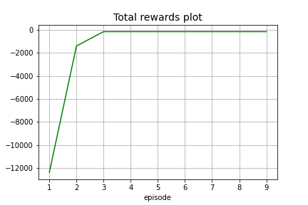

# COMP6247-Maze
Reinforcement Learning Project

Here, a Tabular Q-Learning reinforcement learning algorithm is used to solve a dynamic maze pathfinding problem using only local information. Python file environment.py contains the developed code used for determining the shortest path to the end of the maze.

## Usage

Clone the repository and setup the conda environment to run the code:
```
cd <path_to_COMP6247_Maze>
conda create --name <env> --file requirements.txt
conda activate <env>
```

To run the code:
```
python main.py
```

Alternatively you can open the DynamicMazeQLearning.ipynb file in Jupyter Notebook or Google Colab

If you want to skip the testing function, change the following line in main.py
```
train(6)
to 
test(<num_of_episodes>) // this will utialize the saved q_table.pt file to initialize the Q-table
```

## Graphs

The following plots show the rewards achieved and the amount of walls hit and visited nodes over time during training
10 episodes of training.




## Outputs

The files Output.txt and testing_output.txt represent the state transitioned during training and testing respectively
