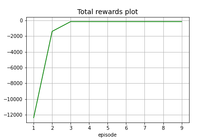
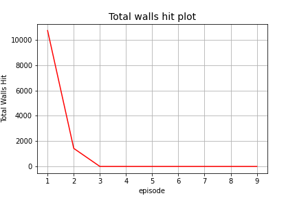
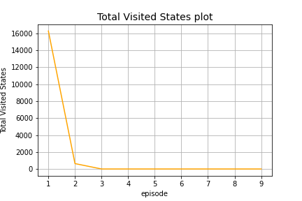

# Dynamic Maze Q-Learning (COMP6247)

Tabular **Q-learning** agent that learns to solve a **dynamic maze** using only local information.
This repo contains the environment, training/evaluation code, and plots showing learning progress.

## TL;DR

- **Method:** tabular Q-learning (ε-greedy), discrete actions (up/left/right/down)
- **Task:** reach the goal in a dynamic maze with penalties for walls / revisits (and optional hazards)
- **Best entry point:** `DynamicMazeQLearning.ipynb`

## Results

During training, the repo logs per-episode metrics and saves plots:

- Total reward per episode
- Walls hit per episode
- Visited states per episode

<p float="left">
  
  
  
</p>

Example path progression snapshots:

<p float="left">
  
  
  
</p>

## Repository structure

- `environment.py` — dynamic maze environment + Q-learning logic
- `DynamicMazeQLearning.ipynb` — notebook walkthrough (recommended)
- `main.py` — script entrypoint (see notes below)
- `requirements.txt` — dependencies
- `q_table.pt` — saved Q-table after training
- `Output.txt`, `testing_output.txt` — state transitions recorded during runs
- `COMP6247CW-20212022.pdf` — coursework brief / problem statement

## Setup

### Option A — run the notebook (recommended)

```bash
pip install -r requirements.txt
jupyter notebook
# open DynamicMazeQLearning.ipynb
```

### Option B — run the script

```bash
pip install -r requirements.txt
python main.py
```

> Note: the notebook is the most reliable way to reproduce the results.
> If `main.py` errors in your environment, use the notebook.

## Training vs evaluation

The typical workflow is:

1. **Train** for N episodes → saves `q_table.pt` and plots
2. **Evaluate** using the saved Q-table

In `main.py`, training is currently triggered with:

```python
train(6)
```

To evaluate using a saved table, switch to:

```python
test(<num_episodes>)
```

## License

See [LICENSE](LICENSE).
